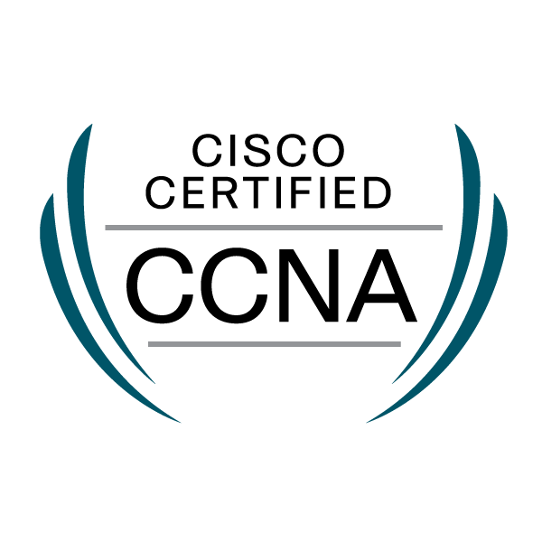

  

   
   
  
  

     
    
Full-stack engineer with 4+ years of experience primarily building dating applications in an agile environment. I’m motivated by the opportunity to help people connect and create meaningful relationships through the products I build. Known for strong communication and close collaboration with both business and engineering teams to deliver user-focused solutions.

  

   
   
  
  

     
    　
    　
    　
    　
    
  

   
   
  
  

     
    　
    　　
    
  

   
   
  
  

     
    
  
 
     
     
  

  

     
    <em>I look forward to solving great challenges together with you. ❤️‍🔥</em>
     
     
    
  

  

